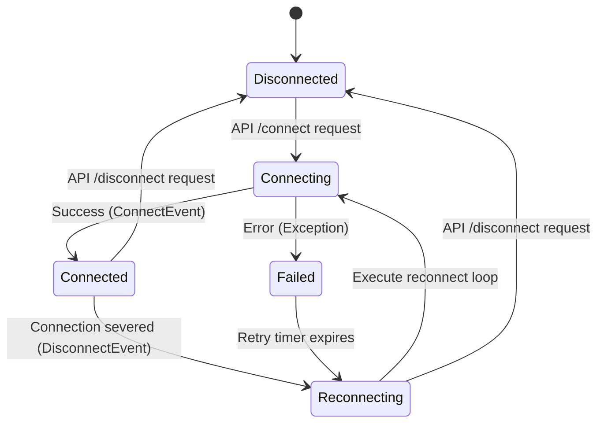

# TikTok LIVE Integration Documentation

This document describes how our Python server integrates with TikTok LIVE stream events.

## Integration Library

We use the unofficial **`TikTokLive`** Python library (specifically the package from GitHub at `isaackogan/TikTokLive`) to capture real-time stream data from the TikTok Webcast service.

### Installation

```bash
pip install TikTokLive --upgrade
```

> [!NOTE]
> Because this is a reverse-engineered library that parses raw TikTok Webcast protobuf events, regular updates of the package are necessary to maintain compatibility when TikTok updates its internal protocols.

---

## Authentication & Credentials

No username credentials, passwords, session tokens, or API secrets are stored or required by this integration. 

Under normal conditions, connecting to public live streams only requires the broadcaster's `@username`. The connection is established directly to public endpoints without logging in.

---

## Event Mapping & Parsing

The application registers async callbacks on the client for the following events:

| TikTok LIVE Event Class | Internal Type | Handled Attributes |
|:---|:---|:---|
| `ConnectEvent` | `connect` | `room_id` |
| `CommentEvent` | `comment` | `user.unique_id`, `user.nickname`, `comment` |
| `GiftEvent` | `gift` | `user.unique_id`, `user.nickname`, `gift.gift_id`, `gift.name` (or extended name), `gift.repeat_count` |
| `LikeEvent` | `like` | `user.unique_id`, `user.nickname`, `like_count` |
| `FollowEvent` | `follow` | `user.unique_id`, `user.nickname` |
| `ShareEvent` | `share` | `user.unique_id`, `user.nickname` |
| `RoomUserSeqEvent` | `viewer` | `total`, `total_user` |

### Raw Payload Serialization

Each event is serialized recursively via a helper function inside the provider, converting nested structures (such as `betterproto` protobuf models, datetime timestamps, and lists) into a clean, JSON-serializable Python dictionary. This dictionary is saved directly in the SQLite `payload` database column to ensure raw logs remain unmodified and inspectable.

---

## Connection Lifecycle & Auto-Reconnect



1. **Explicit API Control**: A client initiates a session by sending a POST request to `/api/connect` containing the username.
2. **Reconnection Loop**: The connection is managed inside an asynchronous loop run in a background task (`asyncio.create_task`).
3. **Exponential Backoff**: If a connection is severed or fails to initialize, the background task waits for a backoff duration before attempting to reconnect.
   - Initial retry wait: **2 seconds**
   - Wait increments: Doubles on each consecutive failure (**2s, 4s, 8s, 16s, 20s**)
   - Max retry wait cap: **20 seconds**
4. **Shutdown / Disconnect**: Calling the `/api/disconnect` route cancels the background task, calls `.disconnect()` on the active `TikTokLiveClient`, closes the current database session, and marks it as `DISCONNECTED`.
