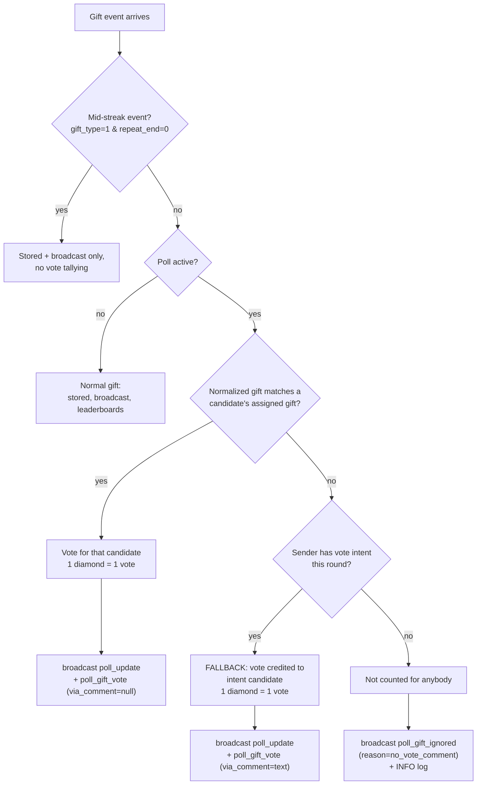

# Gift Voting & Comment Fallback Documentation

This document fully describes how poll votes are collected from TikTok LIVE
**gifts**, including the **comment fallback** mechanism that credits gifts
which match no candidate's assigned gift.

Related: `README.md` (feature overview), `docs/04-tiktok-integration.md`
(event ingestion).

---

## 1. Overview

During an active poll, viewers can vote two ways:

1. **Comment vote** — a chat message matching a candidate by sequence number
   (`01`, `#1`), candidate ID, or name mention. Every matching comment counts;
   a user may vote as many times as they comment.
2. **Gift vote** — sending a TikTok gift. The gift's **total diamond value**
   converts to votes at a fixed rate of **1 diamond = 1 vote** (minimum 1).

Each candidate may be assigned **one gift name** (the "gift boost") in the
Poll Admin page. Gifts are matched by normalized name, and gift votes are
subject to **strict isolation** plus a **comment fallback**:

| Situation | Result |
|:---|:---|
| Gift matches a candidate's assigned gift | Vote for that candidate (1 💎 = 1 vote) |
| Gift matches nobody, sender HAS a vote comment this round | **Fallback:** vote credited to the candidate of the sender's *last vote comment* (1 💎 = 1 vote) |
| Gift matches nobody, sender has NO vote comment this round | Not counted; sender gets feedback (`poll_gift_ignored`) |

The fallback exists because in practice a large share of viewers send popular
gifts that are not part of the candidate setup; without the fallback those
coins would buy no vote at all and viewers had no way to fix it.

---

## 2. Key Concepts

### 2.1 Gift name normalization

Gift names from TikTok may carry emoji, punctuation, or irregular casing
(e.g. `Rose 🌹`). Before comparison, names are normalized
(`app.poll.normalize_gift_name`):

- trimmed and lowercased,
- all emoji/punctuation/symbols removed,
- whitespace collapsed to single spaces.

`" ROSE 🌹 "`, `"rose"` and `"Rose"` all normalize to `rose`. The same
normalization is applied to candidate gift assignments, so assignment and
live events always compare apples to apples.

### 2.2 Strict isolation

A gift only ever counts for **one** candidate:

- Direct match: the candidate whose assigned gift normalizes identically.
- Unmatched gifts never "leak" to a candidate by similarity, price, or
  guesswork.
- Two candidates may not be assigned the same gift — `start_poll` raises a
  `ValueError` up front (it would otherwise silently route every such gift to
  only the first candidate).

### 2.3 Vote intent

Every comment that successfully registers a vote also records the sender's
**vote intent** in `PollManager.vote_intent`:

```python
vote_intent[username_key] = {
    "candidate_id": "2",        # the candidate the comment voted for
    "comment": "02",            # the comment text (for display/audit)
    "at": "2026-08-17T04:12:33+00:00",
}
```

Rules:

- **Keyed by normalized username** (`strip().lower()`), so `@Sultan`,
  `sultan ` and `SULTAN` share one intent.
- **Latest vote comment wins** — each successful comment vote overwrites the
  sender's intent.
- **Non-vote comments never touch intent** — chatter like `wkwkwk` or
  `halo` does not overwrite it (a comment only writes intent when it matches
  exactly one candidate).
- **Ambiguous comments write nothing** — a comment matching multiple
  candidates is rejected as a vote and therefore records no intent.
- **Scoped to the current round** — intent is cleared on every `start_poll`,
  so comments from previous rounds (or before the round started, see §6.4)
  cannot steer fallback votes in a new round.
- **Persisted** — intent is saved with the poll state and restored after app
  restarts (§6.3).

### 2.4 Diamond conversion

```
votes_added = max(1, total_diamonds)
total_diamonds = max(1, quantity) * max(1, diamond_count)
```

The same conversion applies to direct matches and fallback votes. A 5 000-
diamond Rocket sent by a user whose last vote comment was `01` adds **5 000
votes** to candidate #1.

---

## 3. Decision Flow



---

## 4. WebSocket Event Schema

All messages are broadcast to every connected WebSocket client (`/ws`).

### 4.1 `poll_gift_vote` — a gift was counted

Emitted for both direct and fallback votes.

```json
{
  "type": "poll_gift_vote",
  "username": "sultan",
  "nickname": "Sultan ✨",
  "gift_name": "Rocket",
  "diamond_count": 5000,
  "quantity": 1,
  "candidate_name": "Bob",
  "votes_added": 5000,
  "avatar_url": "https://p16-sign.tiktokcdn.com/...",
  "via_comment": "02"
}
```

| Field | Type | Notes |
|:---|:---|:---|
| `diamond_count` | int | Total diamonds (quantity × unit price after streak consolidation) — equals votes added |
| `avatar_url` | string | Sender's TikTok profile picture URL when available (extracted from `avatar_thumb/medium/large` `url_list` or a direct `avatar_url`), else `""` |
| `via_comment` | string \| null | **null** for a direct gift match; the backing comment text for a fallback vote |

### 4.2 `poll_gift_ignored` — a gift was NOT counted

Emitted only while a poll is active, for unmatched gifts from senders with no
vote intent.

```json
{
  "type": "poll_gift_ignored",
  "username": "newbie",
  "nickname": "Newbie",
  "gift_name": "Ice Cream",
  "diamond_count": 30,
  "quantity": 1,
  "avatar_url": "https://p16-sign.tiktokcdn.com/...",
  "reason": "no_vote_comment"
}
```

`reason` is currently always `no_vote_comment` (the gift matched no candidate
and the sender never voted by comment this round). `avatar_url` carries the
sender's profile picture so overlays can show *who* the uncounted gift came
from (used by the Gift Bubbles red bubble).

### 4.3 `poll_update` — refreshed poll state

Sent after every counted vote; contains full candidate list with votes,
percentages and win badges. See `GET /api/poll/status` for the same shape.

### 4.4 Frontend consumers

| Page | `poll_gift_vote` | `poll_gift_ignored` |
|:---|:---|:---|
| `/vote-gift-alert.html` | Gold alert + sound; fallback votes additionally show a `via last comment: "02"` badge | Red `+0 VOTES` card with guidance text, no sound |
| `/gift-bubbles.html` | Candidate bubble (direct: resolved by gift name; fallback: resolved by credited candidate name) | Red bubble showing the **sender's profile picture** with a ❌ badge (gift visible but clearly not counted; falls back to the gift icon when TikTok provides no avatar); raw-event gold bubbles are suppressed during an active poll to avoid duplicates |
| `/poll-admin.html` | Toast for fallback votes explaining the source (`+N via komentar terakhir`) | Warning toast naming sender + gift |
| `/vote-overlay.html` | **Fallback votes:** combo toast shows gift → credited candidate with `+votes` and a `via komentar "02"` pill (direct matches keep their existing streak toast). Reacts to the resulting `poll_update` | **Red warning toast on-stream** naming the sender and gift, telling them to comment the candidate number first (auto-hides after 5 s) |

---

## 5. Code Map

| Location | Responsibility |
|:---|:---|
| `app/poll.py` → `PollManager.vote_intent` | Per-user intent store (in-memory + persisted) |
| `app/poll.py` → `record_vote()` | Comment vote; writes intent on success |
| `app/poll.py` → `record_gift_vote(gift, diamonds, username)` | Direct match → intent fallback → rejection. Returns `(success, candidate_name, votes_added, via_comment)` |
| `app/poll.py` → `normalize_gift_name()` | Gift-name normalization (shared with JS overlays, same rules) |
| `app/poll.py` → `_persist_state()` / `restore()` | Intent survives restarts with the poll state |
| `app/processor.py` | Live routing: passes sender username, tallies streak finals only, broadcasts `poll_gift_vote` / `poll_gift_ignored` |
| `app/routers/poll.py` → `_apply_session_history()` | Replays pre-poll session events at poll start (chronological, so intents build correctly and the fallback applies to replayed gifts) |
| `app/routers/testsim.py` | Simulation endpoints (require `TIKTOBS_TEST_ENDPOINTS=1`) |
| `static/vote-gift-alert.js`, `static/gift-bubbles.js`, `static/poll-admin.js` | Frontend handling per §4.4 |

---

## 6. Behavior Details & Edge Cases

### 6.1 Streak / combo gifts

TikTok streakable gifts (`gift_type == 1`) emit one event per combo increment
plus a final event (`repeat_end == 1`) carrying the full `repeat_count`.
Votes are tallied **once**, on the final event, for
`repeat_count × unit_diamonds`. Mid-streak events are still stored and shown
in live feeds. The fallback follows the exact same consolidation — a Rose x99
combo by a user whose intent is `02` credits 99 × unit price to candidate #2
in a single tally.

### 6.2 No sender information

`record_gift_vote` without a `username` (legacy callers) can never use the
fallback; such unmatched gifts are rejected. The live processor always passes
the sender.

### 6.3 App restart mid-round

Poll state **including vote intent** is persisted to SQLite on every change
and restored by `PollManager.restore()` at startup. A gift sent seconds after
a restart is still credited via the sender's last vote comment.

### 6.4 History replay at poll start

When a poll starts during an active session, events that arrived earlier in
the session are replayed (oldest first): their comment votes count and build
intent, then their gifts are matched/fallback-credited in order. This is the
one case where a comment made *before* `start_poll` influences votes — by
design, matching the existing replay behavior for comment votes.

### 6.5 Poll expiry

The fast-path expiry check runs before matching: an expired poll is stopped
and archived, and the gift is treated as a normal (non-vote) gift. No
`poll_gift_ignored` is emitted once the poll has ended.

### 6.6 Duplicate candidate names

Fallback broadcasts carry `candidate_name`. The gift-bubbles overlay resolves
the credited candidate by name; with duplicate candidate names the first
match is used for the visual. Vote accounting itself uses candidate IDs and
is never affected.

### 6.7 Feature is always on

The fallback has no settings toggle — it is always active while a poll runs.
(Adding a toggle later only requires gating the fallback branch in
`record_gift_vote` plus a Settings flag.)

---

## 7. Observability

Server log lines (all at INFO):

```
Gift vote recorded: 5000 votes added to Bob via gift 'Rocket'.
Gift vote via comment fallback: 5000 votes added to Bob via gift 'Rocket' (sender @sultan last commented '02').
Gift 'Ice Cream' not counted: no candidate owns this gift and the sender has no vote comment this round.
Gift 'Ice Cream' from @newbie not counted: no matching candidate and no vote comment this round (poll 'Ronde 1' active).
```

Useful greps:

```bash
tail -f /tmp/tiktobs-server.log | grep -E "fallback|not counted"
```

---

## 8. Testing

Run the suite (from the project root, virtualenv activated):

```bash
python -m pytest tests/ -q
```

Relevant tests:

| Test | Covers |
|:---|:---|
| `tests/test_poll.py::test_gift_voting_fast_track` | Direct gift matching + diamond conversion |
| `tests/test_poll.py::test_gift_matching_is_strict_and_normalized` | Normalization; unmatched gift without intent counts for nobody |
| `tests/test_poll.py::test_gift_fallback_to_last_vote_comment` | Fallback credits intent candidate; direct gifts skip fallback; no-comment senders get nothing |
| `tests/test_poll.py::test_gift_fallback_follows_latest_vote_comment` | Latest vote comment wins; chatter doesn't overwrite; name-based comments work |
| `tests/test_poll.py::test_gift_fallback_intent_resets_between_rounds` | Intent cleared between rounds |
| `tests/test_poll.py::test_gift_fallback_requires_username` | No sender → no fallback |
| `tests/test_poll_persistence.py::test_vote_intent_survives_restore` | Intent persists across restarts |
| `tests/test_pipeline.py::test_unmatched_gift_during_active_poll_broadcasts_ignored_notice` | `poll_gift_ignored` broadcast + no false vote broadcasts |
| `tests/test_pipeline.py::test_unmatched_gift_falls_back_to_senders_last_comment` | End-to-end through the event processor |
| `tests/test_pipeline.py::test_streak_gifts_are_counted_once_via_final_event` | Streak consolidation (also bounds fallback tallying) |

Manual simulation (server started with `TIKTOBS_TEST_ENDPOINTS=1`):
Poll Admin → *simulate comment vote* (records intent for a random user), then
drive gifts via `/api/test/gift-vote` / `/api/test/gift-normal`; during a live
session `/api/test/gift-normal` routes through the real processor and
exercises the fallback/ignored paths end-to-end.
